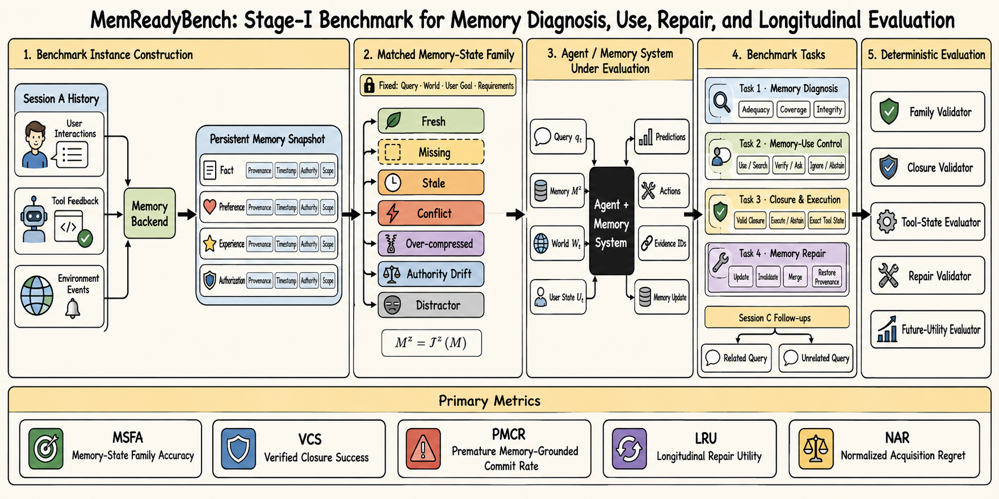

# MemReadyBench Stage-I：Benchmark 任务、接口、参数与指标规范

## 0. 阶段边界

Stage-I 是 **benchmark 与评测协议**，不是训练方法。它把任意 Agent 和 memory system 当作黑盒，只规定：

1. 如何从跨会话历史构造 persistent memory；
2. 如何只对 memory state 施加受控干预；
3. 被测系统接收什么输入、必须输出什么结果；
4. 如何评测 memory diagnosis、memory-use control、closure/execute 和 memory repair；
5. 如何通过后续会话验证 repair 的长期价值。

Stage-I 不定义模型内部 controller、loss、reward model、SFT、RL 或参数更新。图中的 `Memory Repair` 是被测系统需要完成并被评分的任务，不是预设的训练模块。



### 0.1 一句话任务定义

> 在保持当前任务、世界状态、用户目标和行动要求不变时，受控改变由历史交互形成的持久记忆，评测 Agent 是否正确诊断记忆状态、调节记忆对行动的影响、在合法证据闭合后执行，并通过正确修复改善未来会话。

### 0.2 核心因果关系

\[
\text{History}
\rightarrow
\text{Memory Snapshot}
\xrightarrow{\mathcal I_z}
\text{Memory Variant}
\rightarrow
\text{Agent Behavior}
\rightarrow
\text{Repair}
\rightarrow
\text{Future Utility}.
\]

matched family 内固定非记忆因素，因此行为差异主要归因于 memory state，而不是 query 或任务难度变化。

## 1. 完整流程

### 1.1 Step 1：构造 Session A 历史

对 base task \(i\) 生成历史：

\[
H_i=\{h_{i,1},h_{i,2},\ldots,h_{i,L_i}\}.
\]

历史事件包括：

- `USER_INTERACTION`：用户陈述偏好、目标、纠正或授权；
- `TOOL_FEEDBACK`：日历、预订、文件系统等工具返回；
- `ENVIRONMENT_EVENT`：外部状态变化、任务完成或失败；
- `AGENT_ACTION`：Agent 过去采取的行动及其结果。

这些历史必须发生在当前 query 之前，并跨 session 保留。固定文档库或当前上下文中的说明不能代替 persistent memory。

### 1.2 Step 2：形成 Persistent Memory Snapshot

给定 memory backend \(B\)：

\[
M_i=B(H_i)=\{m_{i,1},\ldots,m_{i,K_i}\}.
\]

每个 memory item 定义为：

\[
m_{i,j}=(v_{i,j},p_{i,j},\tau_{i,j},a_{i,j},s_{i,j},\kappa_{i,j}).
\]

其中：

| 符号 | 字段 | 定义 |
|---|---|---|
| \(v_{i,j}\) | `content` | 记忆保存的事实、偏好、经验、约束或授权内容 |
| \(p_{i,j}\) | `provenance` | 内容源自哪个历史事件、用户、工具或系统 |
| \(\tau_{i,j}\) | `timestamp` | 内容产生、观测和写入的时间 |
| \(a_{i,j}\) | `authority` | 谁有权决定该内容：USER、WORLD、POLICY 或 SYSTEM |
| \(s_{i,j}\) | `scope` | 内容适用的用户、任务、时间段、工具或上下文 |
| \(\kappa_{i,j}\) | `integrity` | FRESH、STALE、CONFLICTING、POISONED 或 AUTH_DRIFT |

提供两种设置：

- **Canonical Store**：benchmark 直接提供标准化 memory items，用于隔离 diagnosis 和 control。
- **End-to-End Store**：只提供原始历史，由被测 backend 自行写入、压缩、更新和检索。

### 1.3 Step 3：定义当前任务与固定变量

对同一个 base task 固定：

\[
F_i=(q_i,g_i,W_i,U_i,R_i,\mathcal T_i).
\]

| 符号 | 定义 | 是否直接暴露给 Agent |
|---|---|---|
| \(q_i\) | 当前自然语言 query | 是 |
| \(g_i\) | 结构化任务目标 | 可选；通常由 query 隐式表达 |
| \(W_i\) | 当前真实世界/工具环境状态 | 否；通过 observation 或 world tool 查询 |
| \(U_i\) | 当前用户私有状态，包括意图、偏好和授权 | 否；通过已有记忆或 `ASK_USER` 获取 |
| \(R_i\) | 完成行动所需的 requirement graph | gold；Track A 可部分提供，Track B/C 不直接提供 |
| \(\mathcal T_i\) | 可用工具 schema、前置条件和状态转移 | schema 可见，内部状态不可见 |

这里的“固定”是对 benchmark generator 而言。Agent 只看到其 observable state，不会直接读取完整 \(W_i\)、\(U_i\) 或 gold \(R_i\)。

### 1.4 Step 4：生成 Matched Memory-State Family

定义 memory intervention：

\[
M_i^{z}=\mathcal I_z(M_i),
\quad
z\in\mathcal Z.
\]

\[
\mathcal Z={fresh,missing,stale,conflict,compressed,auth\_drift,distractor\}.
\]

对同一 family：

\[
(q_i,g_i,W_i,U_i,R_i,\mathcal T_i)
\text{ 保持不变，仅 }M_i^z\text{ 改变。}
\]

各干预的操作定义如下：

| 干预 \(z\) | 对 memory 的操作 | 保留的语义 | 主要测试能力 |
|---|---|---|---|
| `FRESH` | 保留完整、当前且可授权使用的 decisive memory | 历史与当前任务一致 | 正确使用记忆，避免多余查询 |
| `MISSING` | 移除或模拟未写入 decisive item | 其他历史与任务不变 | 发现 coverage 缺口 |
| `STALE` | 保留历史上曾正确但当前已失效的值 | 保留原时间与 provenance | 时间敏感的 trust control |
| `CONFLICT` | 增加相互矛盾、来源或时间不同的 items | 冲突必须能由规则解释 | provenance/supersession 推理 |
| `OVER_COMPRESSED` | 用摘要替换原始记录并删除关键限定条件 | 主体语义仍相关 | 识别 consolidation information loss |
| `AUTHORITY_DRIFT` | 保留内容但改变授权有效期、scope 或当前 policy | 值可能仍真实 | 区分 truth 与 permission |
| `DISTRACTOR` | 增加高相似但不支持当前 requirement 的记忆 | decisive evidence 不变 | irrelevant invariance |

不是每个 base task 都必须生成全部七种变体。只有语义合法、权威边界自然且可确定评分的变体才进入 family。

### 1.5 Step 5：运行被测系统

第 \(t\) 个决策点的实际可见输入为：

\[
x_{i,z,t}=(q_i,o_{i,t},M_i^z,\Sigma_{\mathcal T_i},\mathcal B_{i,t}),
\]

其中：

- \(o_{i,t}\)：当前已观察到的工具结果、用户回复与工作上下文；
- \(M_i^z\)：该 episode 的受控 persistent-memory snapshot 或其检索接口；
- \(\Sigma_{\mathcal T_i}\)：可用工具和用户接口 schema；
- \(\mathcal B_{i,t}\)：剩余 token、memory search、world verification、user query 和执行预算。

被测系统输出一条 trajectory：

\[
\hat\tau_{i,z}=
\{(\hat d_t,\hat a_t,\hat E_t,\widehat{\Delta M}_t)\}_{t=1}^{T}.
\]

| 输出 | 定义 |
|---|---|
| \(\hat d_t\) | memory diagnosis：adequacy、coverage、integrity、conflict 和 confidence |
| \(\hat a_t\) | memory-use、evidence acquisition、commitment 或 repair action |
| \(\hat E_t\) | 当前决策引用的 evidence IDs |
| \(\widehat{\Delta M}_t\) | 对 memory 提出的 update、invalidate、merge 或 provenance restoration |

### 1.6 Step 6：Session C 纵向复测

将 Stage-I Task 4 输出的 \(\widehat{\Delta M}\) 应用到原 memory：

\[
M_i'=Apply(M_i^z,\widehat{\Delta M}).
\]

随后运行两组 follow-up：

- \(Q_i^{rel}\)：依赖被修复内容的相关任务，检查是否不再重复错误；
- \(Q_i^{unrel}\)：不依赖该内容的无关任务，检查修复是否污染其他记忆与行为。

## 2. 四个 Benchmark Tasks

### 2.1 Task 1：Memory Diagnosis

**目标**：判断当前 persistent memory 对行动 requirements 是否充分、有效并具有正确作用域。

**输入**：\(q_i\)、当前 observation、\(M_i^z\) 或检索 packet、可见 metadata。

**结构化输出**：

```json
{
  "memory_adequacy": "STALE",
  "covered_requirements": ["preferred_departure_time"],
  "missing_requirements": ["current_flight_inventory"],
  "supporting_memory_ids": ["m_12"],
  "invalid_memory_ids": ["m_17"],
  "integrity_reason": "timestamp_precedes_world_update",
  "confidence": 0.82
}
```

**Gold**：memory adequacy、requirement coverage vector、支持/冲突 memory IDs、integrity reason 和 authority/scope validity。

**主要错误**：把 relevance 当作 sufficiency；忽略 timestamp；把真实但越权的信息当作可执行证据；无法发现摘要遗漏。

### 2.2 Task 2：Memory-Use Control

**目标**：根据 diagnosis 选择记忆如何影响下一步行动。

动作分层定义：

| 动作组 | 动作 | 含义 |
|---|---|---|
| Memory use | `USE_MEMORY` | 当前 memory item 可作为行动证据 |
| Memory use | `SEARCH_MEMORY` | 当前 packet 不足，需要从 persistent store 检索更多历史 |
| Memory use | `IGNORE_MEMORY` | 相关记忆无效、无权限或不适用于当前任务 |
| Acquisition | `VERIFY_WORLD` | 通过工具获取当前 world truth |
| Acquisition | `ASK_USER` | 获取用户私有意图、偏好、纠正或本轮授权 |
| Commitment | `EXECUTE` | 当前证据已形成合法闭包，可以产生外部结果 |
| Commitment | `ABSTAIN` | 证据不可得、policy 禁止或风险不能接受 |

对每个 decision point 提供 admissible action set：

\[
A_{i,z,t}^{adm}\subseteq\mathcal A.
\]

- **Tier 1 Observable Routing**：可见语义足以确定动作，允许唯一或很小的 admissible set。
- **Tier 2 Latent Exploration**：Agent 不知道 hidden store 是否有答案，允许多个合理首动作，通过后续 regret 与停止行为区分策略质量。

### 2.3 Task 3：Closure and Execution

**目标**：判断当前证据是否满足全部行动前置条件，并验证最终环境结果。

设当前累计证据为 \(E_{i,z,t}\)，合法闭包定义为：

\[
C(E_{i,z,t},R_i)=1
\iff
\exists E^*\subseteq E_{i,z,t},
E^*\models R_i,
\]

并且 \(E^*\) 中所有 decisive evidence 均满足 freshness、authority、scope、consistency 和 authorization。

`EXECUTE` 输出必须包括：

```json
{
  "action": "EXECUTE",
  "tool": "calendar.create_event",
  "arguments": {},
  "evidence_ids": ["m_12", "tool_4", "user_2"]
}
```

规则 evaluator 检查：

1. 第一次 commit 前是否已闭合；
2. 是否引用了无效或未授权 memory；
3. tool arguments 是否满足全部 requirements；
4. 最终环境状态 \(s_T\) 是否等于合法目标状态 \(s_T^*\)；
5. `ABSTAIN` 是否发生在确实不可解决或 policy-blocked 的 episode。

### 2.4 Task 4：Memory Repair and Longitudinal Evaluation

**目标**：在新证据揭示 memory 缺失、过期、冲突或 authority drift 后，预测正确维护操作。

Repair action：

| 操作 | 定义 |
|---|---|
| `UPDATE` | 用当前权威值更新同一 memory item，并保留 supersession link |
| `INVALIDATE` | 标记旧记忆不可继续使用，但保留审计历史 |
| `MERGE` | 合并互补 items，同时保留各自 provenance 和适用 scope |
| `RESTORE_PROVENANCE` | 补回 consolidation 中丢失的来源、时间、authority 或 scope |
| `NO_CHANGE` | 新证据不应改变持久记忆 |

Repair 输出至少包含：

```json
{
  "operation": "INVALIDATE_AND_UPDATE",
  "target_memory_ids": ["m_17"],
  "new_content": {},
  "supporting_evidence_ids": ["tool_4"],
  "supersedes": ["m_17"],
  "provenance": {},
  "scope": {}
}
```

Session C 不再修改这些输出，只运行 related/unrelated follow-ups，以 prospective 方式判断 repair 是否有效。

## 3. 五类 Deterministic Evaluators

### 3.1 Family Validator

检查 matched family 是否满足：

- base task 和固定变量一致；
- 仅目标 memory factors 发生变化；
- 干预符合 authority-conditioned semantics；
- variants 不跨 train/dev/test split；
- 文本渲染不存在显式状态标签泄漏。

### 3.2 Closure Validator

根据 requirement graph 与 evidence metadata 计算 closure validity、minimality、invalid evidence use 和 unresolved conflicts。

### 3.3 Tool-State Evaluator

在确定性环境中执行工具调用，比较参数、前置条件、side effects 和 exact postcondition。

### 3.4 Repair Validator

检查 target IDs、operation type、new content、supersession、provenance、timestamp、authority 和 scope 是否正确；不要求物理删除旧记录。

### 3.5 Future-Utility Evaluator

比较 repair 前后在 \(Q^{rel}\) 与 \(Q^{unrel}\) 上的表现，分别衡量修复收益和 collateral contamination。

## 4. 参数与符号总表

### 4.1 数据与环境参数

| 参数 | 类型 | 定义 |
|---|---|---|
| \(i\) | index | base task/family 编号 |
| \(z\) | categorical | memory intervention 类型 |
| \(t\) | index | episode 内决策时间步 |
| \(H_i\) | sequence | Session A 的原始跨会话历史 |
| \(B\) | function/system | memory backend，将历史转换为 persistent memory |
| \(M_i\) | set | 未干预的 memory snapshot |
| \(M_i^z\) | set | 经 \(\mathcal I_z\) 干预后的 memory snapshot |
| \(q_i\) | text | Session B 当前 query |
| \(g_i\) | structured object | query 对应的真实任务目标 |
| \(W_i\) | state | 当前 world/tool latent state |
| \(U_i\) | state | 当前 user latent state |
| \(o_{i,t}\) | observation | 截至 \(t\) 已向 Agent 暴露的环境与交互信息 |
| \(R_i\) | graph/set | 完成行动所需 requirements 与依赖关系 |
| \(\mathcal T_i\) | environment | 工具 schema、前置条件、状态转移和 evaluator |
| \(\mathcal B_{i,t}\) | budget vector | 剩余 token/search/verify/ask/execute 预算 |

### 4.2 Gold 与预测参数

| 参数 | 定义 |
|---|---|
| \(y_{i,z}^{mem}\) | gold memory adequacy 标签 |
| \(c_{i,z,j}\) | requirement \(r_j\) 是否被有效 memory 覆盖 |
| \(S_{i,z}^{+}\) | 支持当前 requirements 的合法 memory IDs |
| \(S_{i,z}^{-}\) | stale/conflicting/unauthorized/distractor memory IDs |
| \(A_{i,z,t}^{adm}\) | 当前 observable state 下合理的动作集合 |
| \(a_{i,z,t}^{*}\) | 在成本模型下的 oracle action |
| \(\hat a_{i,z,t}\) | 被测系统实际动作 |
| \(E_{i,z,t}\) | 时间步 \(t\) 的累计证据集合 |
| \(C(E,R)\) | evidence 是否合法闭合 requirement graph |
| \(s_T,s_T^*\) | 实际和 gold 最终环境状态 |
| \(\widehat{\Delta M}\) | 被测系统预测的 memory repair operations |
| \(M_i'\) | 应用 repair 后的 memory snapshot |
| \(\hat\tau_{i,z}\) | 完整交互、获取、commit 与 repair trajectory |

### 4.3 成本参数

定义 trajectory cost：

\[
J(\tau)=
\lambda_s N_{search}
+\lambda_v N_{verify}
+\lambda_u N_{ask}
+\lambda_{tok}N_{tokens}
+\lambda_{lat}T_{latency}
+\lambda_p I_{premature}
+\lambda_f I_{failure}.
\]

所有 baseline 使用相同 \(\lambda\) 和预算。主结果同时报告原始调用数，避免权重选择掩盖真实行为。

### 4.4 指标参数

| 参数 | 定义 |
|---|---|
| \(N\) | base task/matched family 总数 |
| \(Z_i\) | family \(i\) 中实际存在的语义合法 memory variants |
| \(N_{res}\) | 理论上可获得充分证据并完成执行的 episodes 数 |
| \(N_{commit\text{-}relevant}\) | 存在执行诱因、可用于衡量过早 commit 的 episodes 数 |
| \(t_c\) | 被测系统首次输出 `EXECUTE` 的时间步 |
| \(PV_{i,z}\) | variant \((i,z)\) 的整条 control policy 是否有效 |
| \(Q_i^{rel}\) | 依赖已修复记忆的 Session C 相关任务集合 |
| \(Q_i^{unrel}\) | 不依赖该修复内容的 Session C 无关任务集合 |
| \(S(q;M)\) | 使用 memory \(M\) 完成 follow-up \(q\) 的 VCS 或 exact-success 得分 |
| \(J(\tau)\) | trajectory 的统一风险与资源成本 |
| \(\tau^*\) | 在相同 observable information 和 budget 下的 cost-aware oracle trajectory |
| \(\lambda_*\) | 预先固定的调用、延迟、风险、失败或 contamination 权重 |
| \(\epsilon\) | 防止 NAR 分母为零的极小正数 |

## 5. 一级指标定义

### 5.1 MSFA：Memory-State Family Accuracy

先定义单 episode 的 policy validity：

\[
PV_{i,z}=1
\iff
\forall t,\hat a_{i,z,t}\in A_{i,z,t}^{adm}
\land
\text{termination is valid}.
\]

family-level 指标为：

\[
MSFA=
\frac{1}{N}
\sum_{i=1}^{N}
\mathbf 1[\forall z\in Z_i,PV_{i,z}=1].
\]

它要求同一 base task 的所有 memory variants 均处理正确，可暴露 AlwaysTrust、AlwaysSearch、AlwaysVerify 等惯性策略。报告时同时给出 episode accuracy，二者差距本身是重要发现。

### 5.2 VCS：Verified Closure Success

对可解决 episode：

\[
VCS=
\frac{1}{N_{res}}
\sum_{i,z}
\mathbf 1[
C(E_{t_c},R_i)=1
\land s_T=s_T^*
\land \neg invalid\_memory\_use
].
\]

其中 \(t_c\) 是首次 commit 时刻。VCS 同时要求证据合法和环境结果正确；仅凭猜测得到正确工具状态不计为 verified success。

### 5.3 PMCR：Premature Memory-Grounded Commit Rate

\[
PMCR=
\frac{
\sum_{i,z}\mathbf 1[
EXECUTE\land(C(E_{t_c},R_i)=0
\lor invalid\_memory\_use)]
}{N_{commit\text{-}relevant}}.
\]

`invalid_memory_use` 包括使用 stale、conflicting、unauthorized、out-of-scope 或 poisoned memory 作为 decisive evidence。

### 5.4 LRU：Longitudinal Repair Utility

定义 related-task gain：

\[
G_i^{rel}=\frac{1}{|Q_i^{rel}|}
\sum_{q\in Q_i^{rel}}
[S(q;M_i')-S(q;M_i^z)].
\]

定义无关任务污染：

\[
P_i^{unrel}=\frac{1}{|Q_i^{unrel}|}
\sum_{q\in Q_i^{unrel}}
\max(0,S(q;M_i^z)-S(q;M_i')).
\]

最终：

\[
LRU=\frac{1}{N}\sum_i(G_i^{rel}-\lambda_xP_i^{unrel}).
\]

其中 \(S\) 是 follow-up 的 VCS 或 exact task success，\(\lambda_x\) 是 contamination penalty。必须同时报告 \(G^{rel}\) 和 \(P^{unrel}\)，不能只给合成分数。

### 5.5 NAR：Normalized Acquisition Regret

\[
NAR=
\frac{1}{N}
\sum_{i,z}
\frac{J(\hat\tau_{i,z})-J(\tau_{i,z}^{*})}
{\max(J(\tau_{i,z}^{*}),\epsilon)}.
\]

其中 \(\tau^*\) 是在相同 observable information 与 budget 下的 cost-aware oracle trajectory。NAR 越低越好；失败、premature commit 和无效循环通过 \(J\) 中的惩罚进入指标。

## 6. 二级诊断指标

- Memory Adequacy Macro-F1；
- Requirement Coverage Precision/Recall/F1；
- Integrity 与 Authority/Scope Violation Detection；
- Admissible Action Accuracy；
- Invalid Memory Use Rate；
- Unnecessary Memory Access Rate；
- Closure Validity、Closure Minimality 和 Unsupported Success；
- Repair Operation Accuracy；
- Supersession Correctness；
- Provenance Preservation；
- Related Follow-up Success；
- Collateral Contamination Rate；
- token、search、verify、ask、latency 的原始成本。

不把所有指标压成单一 leaderboard score。主表使用 MSFA、VCS、PMCR、LRU 和 NAR，二级指标用于错误归因。

## 7. 数据公平性与防捷径设计

### 7.1 Authority-Conditioned Families

- 用户偏好只在 visible history、stored memory、ask-user correction 和 unavailable 之间生成自然变体；
- 当前世界状态只在 fresh observation、cached stale memory 和 world verification 间生成变体；
- 授权任务保留 user/policy authority，不因为写入 memory 就变成 memory-authoritative；
- 经验记忆可以测试完整 trace、过度压缩和工具版本不兼容。

### 7.2 Family-Level Split

同一 `base_task_id` 的全部 memory variants、paraphrases 和 Session C follow-ups 必须进入同一个 split，禁止 variant leakage。

### 7.3 Artifact Control

- 屏蔽 `stale/conflict/missing` 等显式标签词；
- 使用 held-out paraphrase renderer；
- 使用 entity、tool schema 与 domain held-out splits；
- 增加 human-rewritten challenge set；
- 训练只看格式的 artifact classifier，验证无法凭模板识别 variant；
- 增加 irrelevant/supportive memory，测试策略 invariance。

## 8. Stage-I Baselines

### 8.1 Sanity Baselines

- NoMemory；
- FullHistory；
- Retrieve-Once@k；
- AlwaysTrustMemory；
- AlwaysSearchMemory；
- AlwaysVerifyWorld；
- AlwaysAskUser；
- NeverUseMemory；
- AlwaysExecute / AlwaysAbstain。

### 8.2 Memory-System Baselines

- BM25、dense、hybrid memory retrieval；
- long-context raw history；
- Mem0/LangMem 类 store；
- A-MEM；
- 带 supersession metadata 的 StateMem-style wrapper。

### 8.3 邻近控制 Baselines

- SafeCommit-style commit/probe/fallback；
- MCB-style remember/verify/ask prompt；
- AgentAbstain-style pre-execution gate；
- MemSyco-style skeptical memory use；
- MemCon/Oblivion-style memory operation policy。

### 8.4 Oracle Ladder

- OracleMemoryContent；
- OracleRetriever；
- OracleMemoryDiagnosis；
- OracleTrustController；
- OracleClosureGate；
- OracleRepairer；
- OracleExecutor；
- OracleAll。

OracleMemoryDiagnosis/OracleTrustController 在 OracleRetriever 之后的增益，是证明“问题不只是检索失败”的关键证据。

## 9. Pilot 配置

### 9.1 最小规模

- 20 个 base tasks；
- calendar/scheduling 与 travel/booking 两个域；
- 每个任务 3–5 个语义合法 memory variants；
- 70–100 个 Session B episodes；
- 每个 repairable episode 至少 2 个 related 和 2 个 unrelated follow-ups；
- memory size 为 20–50 items；
- canonical store 加至少一个 end-to-end memory backend；
- 一个小模型 smoke、一个 7B/8B 开源模型和一个强 API 模型；
- 只评测，不训练。

### 9.2 Go/No-Go

进入完整 benchmark 必须满足：

1. OracleAll 可解率不低于 98%；
2. family intervention 人工语义一致率足够高；
3. MSFA 明显低于 episode accuracy，证明 family protocol 揭示新失败；
4. OracleMemoryDiagnosis/OracleTrustController 在控制 retrieval 后仍有独立增益；
5. FullHistory + prompt 不能在 stale/conflict/authority-drift 上饱和；
6. repair 在 related follow-up 上产生收益，并且 unrelated contamination 可测；
7. 至少 80% 主指标可由 deterministic evaluator 计算；
8. lexical/template artifact baseline 接近随机或显著低于 Agent baseline。

若 memory state 不产生独立行为差异、repair 对未来任务没有可测影响，或所有任务都能被 FullHistory prompt 解决，则停止扩展当前设计。

## 10. 一个完整 Episode 示例

### Session A

用户曾表示：“出差航班默认选择上午，但周一除外，周一优先下午。”工具日志显示该偏好在两次预订中生效。Memory backend 将其过度压缩为“用户偏好上午航班”。

### 固定 Session B Task

- Query：预订下周一去上海的航班；
- World：上午和下午均有余票；
- User goal：遵循既有偏好并完成预订；
- Requirement：目的地、日期、库存、时间偏好和本轮授权；
- Tool schema：搜索航班、查询库存、提交预订。

### Memory Variants

- `FRESH`：完整保存“周一优先下午”；
- `MISSING`：未保存时间偏好；
- `OVER_COMPRESSED`：只保存“偏好上午”；
- `CONFLICT`：同时保存完整原话和错误摘要；
- `DISTRACTOR`：增加大量其他城市和酒店偏好。

### 被测行为

- Task 1 判断 memory 是否充分可信；
- Task 2 决定使用完整记忆、检索原始历史或询问用户；
- Task 3 只在库存、偏好和授权闭合后预订；
- Task 4 将错误摘要失效，并恢复原始偏好的 provenance 与 scope；
- Session C 再次提出周一航班任务，检查是否选择下午；再提出酒店任务，检查修复是否污染酒店偏好。

这个例子中 query、world 和 goal 不变，只有 memory state 改变，因此可以直接观察 Agent 是否真正理解并控制持久记忆。

## 11. Stage-I 最终产物

Stage-I 完成后应发布：

1. 跨会话 history 与 canonical memory snapshots；
2. matched memory-state families；
3. Session B/C executable environments；
4. decision-point joint gold；
5. deterministic evaluators；
6. baseline harness 与 oracle ladder；
7. 数据卡、人工一致性和 artifact audit；
8. 证明 memory diagnosis/control/repair 是否构成独立瓶颈的实证结论。

只有第 8 项成立，第二阶段训练才有研究必要性；训练方法不属于本图和本规范的范围。
