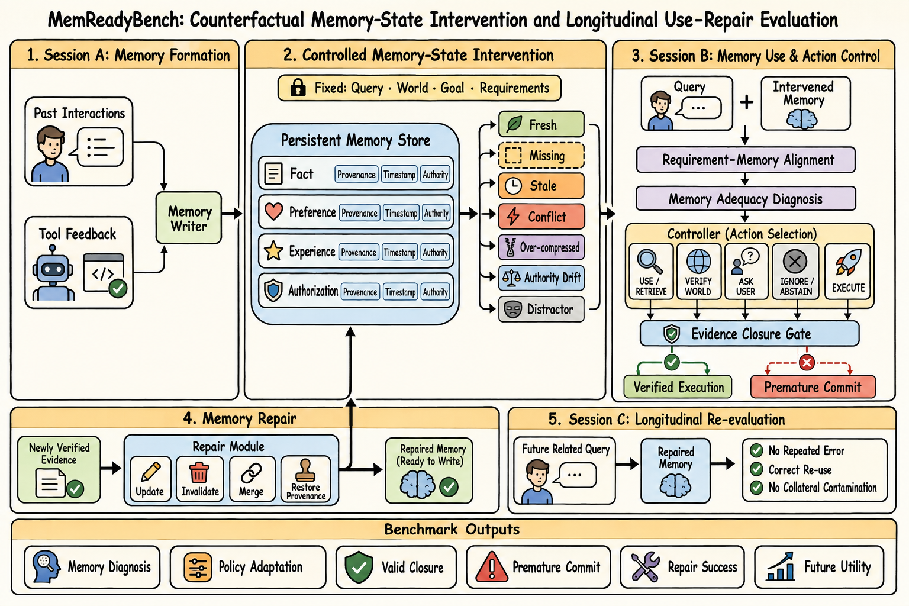

# MemReadyBench：受控记忆状态干预下的使用、行动与修复评测

## 0. 最终统一方案

### 0.1 一句话研究问题

> **面对由过去交互形成、但可能缺失、过期、冲突、过度压缩或失去授权的持久记忆，Agent 能否诊断该记忆对当前行动是否充分可信，正确调节记忆对行动的影响，并在获得新证据后修复记忆，使后续会话不再重复同类错误？**

研究对象是一条跨会话的 memory lifecycle：

1. **Memory formation**：历史交互、工具反馈和用户状态如何形成持久记忆。
2. **Memory-state intervention**：只改变记忆的覆盖度、时效性、冲突、压缩和授权状态。
3. **Memory adequacy diagnosis**：记忆是否覆盖当前 requirement，能否被信任和直接使用。
4. **Memory-conditioned control**：应该使用、继续检索、外部验证、询问、忽略还是拒绝。
5. **Memory repair and re-use**：新证据是否被正确写回，以及未来相关任务是否真正受益。

因此，本项目不是把 memory 当作多个信息源之一，而是把 **persistent memory state 设为受控因果变量**。来源、证据闭合和执行门控只是用于诊断 memory 如何影响行动的内部机制。

> **persistent-memory Agent 的“形成—诊断—使用—校验—修复—再利用”闭环。**

### 0.2 方案框架图



图中的固定项是当前 Query、World State、User Goal 和 Requirement Graph；主要干预只施加在 Persistent Memory Store。这样可以测量记忆状态变化是否因果性地改变控制策略，以及修复后的记忆是否改善未来会话。

### 0.3 推荐标题

> **MemReadyBench: Counterfactual Memory-State Intervention and Longitudinal Use–Repair Evaluation**

较短版本：

> **MemReadyBench: Benchmarking Memory-Conditioned Action Control and Repair**

### 0.4 审稿式判断

- **问题重要性**：强。长期 Agent 会在不完整、过时、冲突或来源错误的记忆上过早行动。
- **问题层首创**：不能声称。SafeCommit 已直接研究 memory uncertainty 下的 safe commitment。
- **可防守创新**：必须落在 controlled memory-state intervention、跨会话 use-repair evaluation、逐决策点联合 gold 和真实 memory stack 诊断的交叉点。
- **方法创新**：第二阶段再做。通用 retriever/router/verifier/gate 的模块组合不足以单独构成贡献，memory repairer 也必须通过未来会话价值验证。
- **资源可行性**：适合四卡 4090。主要工程量是 generator、simulator、validator 和 evaluation harness，而不是大规模预训练。

## 1. 为什么要做：问题来自哪些已有工作

### 1.1 Strategic memory use 不等于行动准备度

[StratMem-Bench](https://aclanthology.org/2026.acl-long.1491/) 评估给定候选记忆后，哪些是 required、supportive 或 irrelevant，核心问题是“应该使用哪些记忆”。它不要求 Agent 主动搜索、验证世界、询问用户，也不判断当前证据是否足以执行带副作用的动作。

[Mem2ActBench](https://aclanthology.org/2026.acl-long.370/) 已把长期记忆用于 tool selection 和 parameter grounding，但主要输出是离线 tool call；它揭示了 retrieval 与 oracle retrieval 的明显差距，却没有把 search、verify、clarification 和 abstention 作为正式在线控制动作。

由此得到第一层问题：

> 检索到相关记忆，并不意味着已经获得了执行所需的最小充分证据。

### 1.2 Safe commitment 已被提出，但真实 memory stack 仍缺少诊断

[SafeCommit](https://arxiv.org/abs/2608.04289) 已形式化 memory uncertainty 下的 premature commitment，在 `commit / probe / fallback` 中进行风险控制。这意味着“判断现有证据是否足以安全行动”不能再作为首创。

但 SafeCommit 当前实验是 proof-of-concept：使用少量显式 latent worlds、固定 action set、手工 safety map 和确定性二值 probe，尚未系统评估真实 LLM 如何从自然语言长历史、检索 packet 和持久 memory backend 中恢复证据状态。

由此得到第二层问题：

> 需要把安全承诺从理想化 world set 推进到真实 memory system 的 reader、retriever、controller 和 executor 诊断。

### 1.3 Verify world 与 ask user 是不同的 source-of-truth 边界

[Remember, Verify, or Ask?](https://arxiv.org/abs/2608.19564) 区分 persist、current-only、verify-world 和 ask-user，证明变化的世界事实与只有用户知道的意图/授权不能统一处理。但它研究的是信息写入或记忆承诺边界，动作被记录而不执行，也没有 query-time 多步获取与最终环境结果。

[KnowU-Bench](https://arxiv.org/abs/2604.08455) 进一步在 Android 环境中测试 preference elicitation、consent 和 proactive intervention，说明用户来源和可执行闭环均已有邻近工作。

由此得到第三层问题：

> 记忆不足不是单一状态；真正的 memory-use 难点是判断持久记忆何时可直接信任，何时必须检索原始历史、外部验证、重新询问或忽略。

### 1.4 Paired act/abstain 和 memory skepticism 也已有工作

[AgentAbstain](https://arxiv.org/abs/2607.10059) 已使用成对单因素任务和可执行 sandbox 测试 Agent 何时不应行动。因此 paired task、action flip 和 executable abstention 不能作为单独创新。

[MemSyco-Bench](https://arxiv.org/abs/2607.01071) 已评估记忆何时不应被当作事实、如何处理记忆与客观证据冲突以及如何限制记忆作用域。因此“记忆并不总是有益”也不是新结论。

仍然缺少的，是把反事实干预明确施加在 **交互生成的 persistent memory state** 上，并跨后续会话检查信任控制、修复与未来复用。

### 1.5 Sufficiency router 与 memory operation policy 已经存在

- [Router-Mem](https://arxiv.org/abs/2608.01285) 已根据 evidence sufficiency 决定提前停止还是深度分析。
- [InfMem](https://arxiv.org/abs/2602.02704) 已使用 PreThink-Retrieve-Write 和 SFT-to-RL 控制检索、写入和停止。
- [SURE-RAG](https://arxiv.org/abs/2605.03534) 已将 evidence sufficiency 定义为集合级属性。
- [Memory as a Controlled Process](https://arxiv.org/abs/2607.13591) 已把 retrieve、re-retrieve、plan injection、consolidate 和 forget 建模为 memory MDP。
- [Oblivion](https://arxiv.org/abs/2604.00131) 已依据 uncertainty 和 memory utility 决定何时访问记忆。

因此，`retrieve-or-stop`、`operation-as-action`、`setwise verifier` 或 SFT-to-RL 均只能作为 baseline 或实现组件，不能单独锚定贡献。

### 1.6 最危险的邻近工作进一步限定了边界

- [EComAgentBench](https://arxiv.org/abs/2606.17698) 已覆盖 distributed requirements、profile/user clarification、长期工具执行和 source-tagged failure attribution，因此“多来源要求 + 最终执行”不是本项目创新。
- [AuthMem-Bench](https://arxiv.org/abs/2608.01679) 已覆盖 consolidation 过程中的 authority preservation，因此 authority intervention 本身不能作为创新。
- [MemFail](https://arxiv.org/abs/2605.26667) 已诊断 summarization、storage 和 retrieval failure，因此 memory system decomposition 本身也不是创新。

本项目只保留更窄的交叉点：**同一跨会话任务中的 persistent memory state 被受控改变，Agent 必须调整 memory-use policy，并在校验后修复该记忆；修复价值由未来相关与无关任务共同验证。**

## 2. 统一的 Research Gap

### 2.1 中文版本

> 近期工作已经分别研究了战略记忆选择、记忆充分性、安全承诺、写入边界、abstention、authority preservation 和 memory operation policy；但这些评测通常固定持久记忆的状态，或者只观察单次任务结果。尚缺少一种以 **persistent memory state 为受控变量** 的纵向评测：在保持当前任务、世界状态、用户目标与 requirement graph 不变时，系统性改变记忆的覆盖度、时效性、冲突、压缩和授权完整性，测量 Agent 是否相应调整记忆信任与行动策略，并在校验后正确修复记忆、改善未来会话而不污染无关行为。

### 2.2 英文版本

> Recent work has studied strategic memory use, memory sufficiency, safe commitment, memory-boundary decisions, abstention, authority preservation, and memory-operation policies. Yet existing evaluations usually hold the persistent-memory state fixed or collapse the lifecycle into a single task outcome. What remains under-evaluated is whether agents correctly regulate the influence of interaction-derived memory when its coverage, freshness, consistency, compression, or authorization status is counterfactually changed, and whether they repair that memory after verification so that later sessions improve without collateral contamination.

### 2.3 核心创新锚点

本项目的创新不写成某个模型组件，也不写成“把多个任务合并”，而写成下面的评测协议：

> **Counterfactual memory-state intervention + memory-conditioned action control + longitudinal memory repair evaluation**

更具体地说：

1. **Memory-state intervention**：固定 query、world、goal 和 requirements，只改变 persistent memory，建立记忆对行为的因果归因。
2. **Memory adequacy diagnosis**：判断记忆是否覆盖当前 requirement，以及内容、来源、时间、作用域和授权是否仍有效。
3. **Memory-conditioned control**：根据记忆状态选择 use、retrieve、verify、ask、ignore、abstain 或 execute，而不是形成固定搜索惯性。
4. **Longitudinal repair**：发现错误后执行 update、invalidate、merge 或 provenance restoration，并在未来相关任务中验证修复价值。
5. **Prospective decomposition**：通过 oracle memory content/retrieval/diagnosis/control/repair/execution 分离真实 memory stack 的失败位置。

### 2.4 三个 Research Questions

**RQ1：Memory Adequacy Diagnosis**

> Agent 能否判断持久记忆对当前行动 requirements 的覆盖程度、时效性、权威性、作用域和一致性？

**RQ2：Memory Trust and Use Control**

> 当同一任务的 persistent memory state 被受控改变时，Agent 能否正确调节记忆对行动的影响，并选择使用、继续检索、验证、询问、忽略或拒绝？

**RQ3：Memory Repair and Longitudinal Value**

> Agent 发现记忆错误或缺口并获得新证据后，能否正确修复持久记忆，使未来相关任务不再重复错误，同时不污染无关任务？

## 3. 统一概念模型

### 3.1 六阶段 Memory Lifecycle

| 阶段 | 核心问题 | 主要输出 | 典型错误 |
|---|---|---|---|
| L1 Form | 过去交互如何形成记忆？ | memory item + metadata | 漏写、错误摘要、来源丢失 |
| L2 Diagnose | 记忆对当前需求是否充分可信？ | coverage / integrity / authority / scope | 把相关当充分；信任旧值 |
| L3 Control | 记忆应如何影响下一步？ | use / retrieve / verify / ask / ignore | 盲目信任或永远不用记忆 |
| L4 Commit | 当前是否形成合法行动闭包？ | closure + admissible action | premature commit、越权执行 |
| L5 Repair | 新证据应如何写回记忆？ | update / invalidate / merge / provenance | 旧值残留、错误覆盖、再次污染 |
| L6 Re-evaluate | 修复是否改善未来任务？ | future utility + contamination | 重复错误或伤害无关任务 |

这六阶段共同定义 **Memory-Conditioned Action Control and Repair**。Source routing、evidence closure 和 execution gate 均保留，但服务于 memory lifecycle，而不是作为 benchmark 身份。

### 3.2 受控 Memory-State Slices

对同一个 base task，固定当前 query、world state、user goal 和 requirement graph，只改变从历史交互形成的 persistent memory：

| Memory Slice | 记忆状态 | 主要能力 | 典型合理控制 |
|---|---|---|---|
| `FRESH_COMPLETE` | requirement 已被有效记忆覆盖 | 正确使用记忆 | USE / EXECUTE |
| `MISSING` | decisive memory 未形成或未保留 | 识别覆盖缺口 | RETRIEVE / VERIFY / ASK |
| `STALE` | 历史内容曾正确但当前失效 | 时间敏感信任控制 | VERIFY / IGNORE |
| `CONFLICTING` | 多条记忆相互冲突 | provenance 与 supersession | VERIFY / ASK / RECONCILE |
| `OVER_COMPRESSED` | 摘要丢失限定条件或授权 | 识别 consolidation loss | RETRIEVE RAW / ASK |
| `AUTHORITY_DRIFT` | 内容存在但权限或作用域失效 | 授权边界 | ASK / POLICY BLOCK |
| `DISTRACTOR` | 高相关但不支持 requirement | 抗记忆干扰 | 保持原策略 |
| `NO_MEMORY_NEEDED` | 当前观察已闭合任务 | 避免不必要记忆访问 | EXECUTE |

所有变体必须由同一段历史语义或等价历史事件派生，并按 `base_task_id` 放入同一数据划分。不是把事实任意搬到不同来源，而是对合法的 memory lifecycle failure 进行干预。

## 4. 正式问题定义

### 4.1 环境与持久记忆

在时间步 \(t\)，Agent 接收：

- 当前目标 \(g_t\)；
- 当前环境观察 \(o_t\)；
- 由历史交互、行动与反馈形成的持久记忆库 \(M_t\)；
- 当前工作上下文中的 evidence packet \(C_t\)；
- 外部世界接口 \(W_t\)，如 calendar、booking、filesystem；
- 用户接口 \(U_t\)，提供私有意图、偏好或授权；
- 剩余预算 \(b_t\)，包括 token、检索、验证、询问和环境步骤。

只有当 memory 来自跨 session 的 interaction history 并持续影响后续决策时，主任务才归入 Agent Memory；若只是固定外部文档库，则更接近 Agentic RAG，可作为 transfer setting。

### 4.2 Persistent Memory Object

持久记忆不是静态文档库，而是由历史会话生成并跨 session 保留的内部状态：

\[
M_t = \operatorname{MemSystem}(H_{1:t-1}).
\]

每条 memory item 至少包含：

\[
m_i=(content, provenance, timestamp, authority, scope, status).
\]

benchmark 同时保留原始历史 \(H\)、canonical memory \(M^*\) 和真实 backend 生成的 \(M_t\)，以区分 formation、consolidation、retrieval 与 use-time control 的错误。

### 4.3 Counterfactual Memory-State Intervention

定义干预算子 \(\mathcal I_z\)，只改变 memory state：

\[
M_t^{(z)}=\mathcal I_z(M_t),
\quad
z\in\{fresh,missing,stale,conflict,compressed,auth\_drift,distractor\}.
\]

matched family 中以下变量保持不变：

\[
(g_t,o_t,W_t,U_t,R(g_t)).
\]

因此，策略差异可以归因于持久记忆状态，而不是 query、世界真值、用户目标或任务难度变化。

### 4.4 Requirement–Memory Closure Graph

每个任务具有行动要求 \(R(g_t)=\{r_1,\ldots,r_n\}\)。为避免把“权威来源”“存储位置”和“可获得性”混为一谈，分别定义：

\[
authority(r)\in\{USER,WORLD,POLICY,SYSTEM\},
\]

\[
available\_at(e,t)\in\{PACKET,MEMORY,TOOL,USER,UNAVAILABLE\},
\]

\[
integrity(e)\in\{FRESH,STALE,CONFLICTING,POISONED,AUTH\_DRIFT\}.
\]

图中记录 `supports`、`refutes`、`supersedes`、`authorizes`、`derived_from` 和 `stored_as`。当前证据集合 \(E_t\) 形成合法闭包，当且仅当存在至少一组证据完整覆盖必要 requirements，且每条证据满足 authority、freshness、scope 与 authorization 约束：

\[
Closed(E_t,g_t)=1
\iff
\exists E_k^*\subseteq E_t,
E_k^*\models R(g_t).
\]

允许多个合法闭包；memory relevance 不能替代 closure validity。

### 4.5 Memory Adequacy

对当前任务定义：

\[
y_t^{mem}\in\{ADEQUATE,INCOMPLETE,STALE,CONFLICTED,UNAUTHORIZED,IRRELEVANT\}.
\]

该标签回答“当前持久记忆能否被合法用于当前行动”，而不是泛化的模型置信度。每个 requirement 还提供 memory coverage、支持 item、缺失字段和失效原因。

### 4.6 分层动作空间

动作不设为一个扁平五分类，而分成四组：

- **Memory use**：`USE_MEMORY / SEARCH_MEMORY / IGNORE_MEMORY`；
- **Evidence acquisition**：`VERIFY_WORLD / ASK_USER`；
- **Commitment**：`EXECUTE / ABSTAIN`；
- **Memory maintenance**：`UPDATE / INVALIDATE / MERGE / RESTORE_PROVENANCE`。

`EXECUTE` 必须引用形成闭包的 evidence IDs；repair action 必须声明目标 memory IDs、新证据和 supersession relation。

### 4.7 Partial Observability 与两级 Gold

不能依据隐藏 memory store 强迫唯一第一动作，评测分为：

1. **Tier 1: Observable Memory Routing**。requirement 语义或 metadata 足以判断应优先访问或质疑哪类记忆，使用 exact/admissible action accuracy。
2. **Tier 2: Latent Memory Exploration**。Agent 不知道 store 是否包含答案，允许多个 admissible first actions，使用 information gain、sequential regret、失败后的策略更新和 acquire-to-closure cost。

每个 decision point 分开保存 latent state、observable state、admissible action set、action cost/risk 和 cost-aware oracle，避免 action flip 与部分可观测性定义冲突。

### 4.8 Memory Repair 与未来价值

Agent 获得权威新证据后产生 \(M_{t+1}\)。repair 正确性不能只根据当前写入内容判断，而要通过未来相关任务 \(g_{t+k}\) 验证：

\[
\Delta U_{future}=U(g_{t+k};M_{t+1})-U(g_{t+k};M_t).
\]

同时在无关任务集合上测 collateral contamination，防止一次修复错误覆盖仍然有效的偏好、经验或授权。

## 5. Benchmark 的五个创新点

### 5.1 Counterfactual Memory-State Intervention

基本评测单位不是单个 episode，而是 matched memory-state family。保持任务与外部真值不变，只改变交互生成记忆的 coverage、freshness、consistency、compression、authority 或 distractor composition。

### 5.2 Memory-Conditioned Policy Adaptation

评测 Agent 是否因为 memory state 的变化而定向调整记忆使用策略。重点识别 `AlwaysRetrieve`、`AlwaysTrust`、`AlwaysVerify` 和 `NeverUseMemory` 等 memory-use inertia。

### 5.3 Authority-Conditioned Natural Families

不要求每条事实都拥有所有变体，而按权威属性构造自然 family：

| Family | 合法 Memory 变体 | 典型控制 |
|---|---|---|
| User preference | fresh stored / missing / conflicting / superseded | use / retrieve / ask / invalidate |
| World state | fresh result / cached stale / conflicting update | use / verify / supersede |
| Authorization | valid stored / scope lost / expired / policy blocked | use / ask / abstain / invalidate |
| Experience | complete trace / over-compressed / incompatible tool version | reuse / retrieve raw / ignore / update |

整个数据集覆盖完整动作空间即可，不机械制造不自然的全笛卡尔积。

### 5.4 Use–Commit–Repair Longitudinal Evaluation

联合检查：

1. **Policy Adaptation**：memory state 改变时，控制策略按 admissible set 调整；
2. **Valid Closure Before Commit**：只有有效、权威且作用域正确的证据可支持执行；
3. **Repair Correctness**：新证据正确 update/invalidate/merge 旧记忆；
4. **Future Utility**：后续相关任务不再重复错误；
5. **Irrelevant Invariance**：修复与新增记忆不污染无关任务。

Access-relocation family 可以要求相同合法终态；integrity intervention 可能改变合法行动，只要求拒绝无效证据并作出正确 policy adjustment。

### 5.5 Decision-Point Joint Gold 与 Oracle Decomposition

每个关键决策点联合标注 memory coverage、integrity、authority、scope、missing requirement、admissible actions、closure、repair operation 和 exact postcondition。Oracle ladder 分离：

- memory formation/consolidation failure；
- retrieval failure；
- memory adequacy diagnosis failure；
- trust/control failure；
- closure/commit failure；
- repair/maintenance failure；
- execution failure。

## 6. 三个递进 Track

### Track A：Canonical Memory Diagnosis

给定 canonical memory entries、metadata 和当前任务，预测 requirement coverage、memory adequacy、失效原因、支持/冲突 item 与 admissible memory-use action。

目的：隔离 memory reader 和 diagnosis，验证模型是否真正理解 stale、conflict、compression loss、authority drift 和 no-memory-needed。

### Track B：End-to-End Memory Use and Action Control

只提供原始跨会话历史，由真实 memory backend 写入、压缩和检索；Agent 在线选择 use/search/verify/ask/ignore/execute/abstain，并进入确定性工具环境。

目的：联合评估 memory formation、retrieval、trust control、closure 和 executable outcome，同时用 oracle 区分各层失败。

### Track C：Longitudinal Memory Repair

在 Session B 暴露过期、冲突或缺失记忆，提供可获得的新证据；Agent 选择 update/invalidate/merge/restore-provenance。Session C 使用相关与无关 follow-up tasks 检查 future utility 和 collateral contamination。

目的：让 benchmark 从单次 read/use 扩展到真正的 persistent memory lifecycle。

## 7. 数据构造

### 7.1 Symbolic World First

1. 定义 domain entities、state transitions、tool contracts 和 source authority。
2. 采样 base goal 与 requirement graph。
3. 生成 3–8 个历史 sessions，包括用户陈述、Agent 行动、工具反馈和状态更新。
4. 从历史构造持久 memory store，不直接手写最终 memory answer。
5. 生成 canonical memory，并施加语义合法的 memory-state intervention。
6. 派生 Session B 的 use/control episode 与 Session C 的 repair follow-up。
7. 用模板和 LLM 渲染自然语言对话、日志和 memory entries。
8. 运行 deterministic validator 检查 memory adequacy、closure、repair 和 environment outcome。
9. 人工审核记忆演化自然度、歧义和唯一干预因素。

### 7.2 首批任务域

#### Personalized Tool Execution

日历、出行、预订、提醒和文件操作。历史偏好来自 memory，当前状态来自 world，一次性意图/授权来自 user，最终 tool state 可规则评分。

#### Progressive Search and Planning

Agent 跨 session 收集约束与工具反馈，后续任务依赖早期发现。使用本地文档库或 deterministic mini-web，gold 是 requirement closure、规划约束和最终执行状态。

Pilot 优先 calendar/scheduling 与 travel/booking。Coding/file operation 和 communication/email 在 MVP 后扩展。

### 7.3 Hard Negatives

- 同一实体和主题，但参数属于旧 session。
- 历史默认偏好与本轮一次性指令冲突。
- 相关但无法唯一执行的 partial evidence。
- 旧 world state 被当前环境覆盖。
- 真实但不再授权使用的信息。
- 从成功经验抽取、但与当前工具版本不兼容的策略。
- supportive memory 很有帮助，但并非 action requirement。
- 完整答案附近的高相似错误值。

### 7.4 数据 Schema

```json
{
  "episode_id": "...",
  "base_task_id": "...",
  "domain": "travel_booking",
  "session_a_history": [],
  "canonical_memory": [],
  "backend_memory": [],
  "memory_intervention": {
    "type": "STALE",
    "target_memory_ids": ["m_17"],
    "held_fixed": ["query", "world", "goal", "requirements"]
  },
  "world_state": {},
  "user_state": {},
  "initial_packet": [],
  "goal": {},
  "requirements": [
    {
      "id": "purchase_authorization",
      "required": true,
      "authority": "USER",
      "available_at": "MEMORY",
      "integrity": "STALE",
      "memory_coverage": "INVALID"
    }
  ],
  "decision_points": [
    {
      "memory_adequacy": "STALE",
      "missing_requirements": ["purchase_authorization"],
      "admissible_actions": ["ASK_USER", "IGNORE_MEMORY"],
      "action_costs": {"ASK_USER": 1.0, "SEARCH_MEMORY": 2.5},
      "forbidden_actions": ["EXECUTE"]
    }
  ],
  "gold_repair": {
    "operation": "INVALIDATE_AND_UPDATE",
    "target_memory_ids": ["m_17"]
  },
  "gold_final_action": {},
  "gold_environment_state": {},
  "session_c_followups": {
    "related": [],
    "unrelated": []
  },
  "budgets": {"search": 3, "verify": 2, "ask": 1}
}
```

### 7.5 数据规模

#### Pilot

- 20 个 base tasks；
- 每个构造 3–5 个语义合法的 memory-state variants，共 70–100 个 Session B episodes；
- 每个可修复 episode 配置相关与无关 Session C follow-up；
- 2 个任务域；
- 20–50 条 memory entries；
- canonical store 与至少一个 end-to-end memory backend；
- 先使用 prompt/rule baselines，不训练。

#### MVP Paper Version

- 300–500 个 base tasks；
- 2,000–4,000 个 Session B 主 episodes及配套 Session C follow-ups；
- 5,000–10,000 个 decision points；
- memory size 为 20/100/500 三档；
- 3–4 个任务域；
- 至少 10% human-authored/re-written challenge split；
- hidden generated test 支持重新采样，降低 contamination。

所有 counterfactual variants 必须以 `base_task_id` 为单位进入同一 split。

## 8. 指标体系

主表只保留四个一级指标：

1. **Memory-State Family Accuracy (MSFA)**：同一 base task 的全部合法 memory variants 是否都采取 admissible memory-use policy。
2. **Verified Closure Success (VCS)**：首次 commit 前已形成合法 closure，且 exact environment outcome 正确。
3. **Premature Memory-Grounded Commit Rate (PMCR)**：因使用无效、过时、冲突或无授权记忆而过早执行的比例。
4. **Longitudinal Repair Utility (LRU)**：修复后相关 follow-up 的收益减去无关任务 collateral contamination。

诊断指标包括：

- Memory Adequacy Macro-F1 与 calibration；
- Requirement Coverage / Missing Requirement F1；
- Stale、Conflict、Compression Loss 和 Authority Drift 检出率；
- Admissible Action Accuracy 与 Normalized Acquisition Regret；
- Invalid Memory Use、Unnecessary Memory Access 和 Unsupported Success；
- Repair Operation Accuracy、Supersession Correctness 和 Provenance Preservation；
- token、retrieval、verification、user-call 与 latency cost。

来源路由只作为 memory trust/control 的诊断指标，不再作为 benchmark 主身份。

## 9. Baseline 与公平比较

### 9.1 Sanity Baselines

- NoMemory、FullHistory、Retrieve-Once@k；
- AlwaysExecute、AlwaysSearch、AlwaysVerify、AlwaysAsk、AlwaysAbstain；
- RandomRoute；
- lexical memory-state artifact classifier；
- confidence threshold。

### 9.2 Retrieval 与 Memory Systems

- BM25、dense、hybrid retrieval；
- long-context history；
- Mem0/LangMem 类 store；
- A-MEM；
- StateMem-style supersession wrapper；
- StratMem-style direct reader。

### 9.3 Agentic Control Baselines

- SafeCommit 风格 `commit/probe/fallback` wrapper；
- MCB 风格 source-of-truth prompt；
- AgentAbstain 风格 pre-execution gate；
- SURE-RAG 风格 setwise verifier；
- Router-Mem 风格 early-stop router；
- MemSearcher、Memory-R1、AgeMem；
- MemCon 与 Oblivion。

### 9.4 Oracle Ladder

- OracleMemoryContent；
- OracleRetriever；
- OracleMemoryDiagnosis；
- OracleTrustController；
- OracleClosureGate；
- OracleRepairer；
- OracleExecutor；
- OracleAll。

所有方法固定 backbone、tool schema、可见接口、token、检索轮数、world/user 调用次数和 wall-clock budget。

## 10. 核心实验

### E0：Benchmark Validity

- OracleAll 可解率；
- 人工 memory-state/integrity/authority/action 一致率；
- 删除 decisive evidence 是否破坏 closure；
- 加入 irrelevant evidence 是否保持 oracle action；
- lexical shortcut 与 template leakage 检查。

### E1：Main Benchmark

比较不同模型、long-context/RAG/memory backend/controller 的四组指标，重点展示 task success 相近但控制质量不同的系统。

### E2：Counterfactual Memory-State Intervention

在固定 query/world/user/requirements 下比较 fresh、missing、stale、conflict、compressed、authority-drift 和 distractor variants，报告 MSFA、policy adaptation 与 invalid memory use。

### E3：Canonical Store vs End-to-End Memory

Canonical setting 隔离 diagnosis/control；end-to-end setting 从原始历史开始，比较不同 backend 的 formation、consolidation、retrieval 和 use-time failure。

### E4：Longitudinal Memory Repair

在 Session B 纠正错误后，评估 repair operation、Session C related-task gain 和 unrelated-task contamination。

### E5：Oracle Failure Decomposition

依次替换 memory content、retriever、diagnoser、trust controller、repairer 和 executor，量化各层的独立边际贡献。

### E6：Calibration、Budget and Scaling

控制 memory size、top-k、历史长度、consolidation rate、最大 acquisition rounds、token 和模型尺寸，比较 risk–coverage 与 success–cost Pareto。

### E7：Cross-Domain Generalization

在一个工具域调节 controller，在另一个域测试；检查策略是否只记住模板。

## 11. 可证伪假设

- **H1**：单 episode task success 会显著高估 memory control；同一模型的 MSFA 明显低于 episode accuracy。
- **H2**：强模型在 fresh/stale/conflict/compressed memory 间存在稳定的 memory-use inertia，不能作出正确策略迁移。
- **H3**：控制 retrieval 质量后，OracleMemoryDiagnosis/OracleTrustController 仍能带来独立收益，说明瓶颈不只是“没搜到”。
- **H4**：FullHistory 可减少 missing-memory 错误，但会放大 stale、conflict、authority drift 和 distractor 风险。
- **H5**：没有显式 repair 的 Agent 会在 Session C 重复 Session B 已暴露的错误。
- **H6**：正确 repair 能提高 related future utility，但粗暴 overwrite 会造成 collateral contamination。

如果简单 `FullHistory + prompt` 已接近 oracle、memory state 对策略没有独立影响，或 repair 无法产生可测的未来收益，则 benchmark 缺乏必要性，应停止扩展或转向纯 memory-system diagnosis。

## 12. 第二阶段方法：Memory Trust Controller and Repairer

Benchmark 先于 Method。只有 E1–E5 明确显示 memory diagnosis、trust control 或 repair 是独立瓶颈，才训练方法。

### 12.1 Reference Architecture

1. Requirement–Memory Aligner：判断每个 requirement 被哪些 memory items 覆盖。
2. Memory Provenance and Integrity Reader：读取时间、来源、scope、authority、supersession 与 consolidation trace。
3. Memory Adequacy Monitor：输出 adequate/incomplete/stale/conflicted/unauthorized/irrelevant 及 calibration。
4. Trust-and-Acquisition Controller：决定 use/search/verify/ask/ignore/abstain。
5. Evidence Closure Gate：未形成合法闭包时阻止 side effect。
6. Memory Repairer：根据新证据执行 update/invalidate/merge/restore-provenance。
7. Future-Utility Critic：估计修复对相关和无关未来任务的影响。

这些模块是 reference implementation，不将模块组合本身作为主要创新。

### 12.2 Pointwise、Pairwise 与 Listwise 的位置

- **Pointwise**：预测单条 memory 的 coverage、freshness、authority、scope 和 repair status。
- **Pairwise**：比较可信 memory 与 stale/conflicting hard negative，或比较正确控制/修复动作与惯性动作。
- **Listwise/Setwise**：从 memory set 中选择最小合法支持集，并对 use/retrieve/verify/ask/ignore 与 repair options 联合排序。

训练创新应落在 **同一 counterfactual family 的 memory-state transition supervision**：当 memory 从 fresh 变为 stale/conflict/compressed/authority-drift 时，模型必须改变 trust、acquisition 和 repair policy，而不是只提高静态分类准确率。

### 12.3 训练路线

1. Prompt/rule controller：验证 benchmark 和错误谱系。
2. SFT：学习 memory adequacy、requirement coverage、trust action、closure 和 structured repair calls。
3. Pairwise control：正确 memory-use/repair 动作对 stale-trust、wrong-overwrite 等 hard negative。
4. Listwise admissible ranking：在 memory set、获取动作和 repair actions 中最小化风险与长期 regret。
5. Optional RL：只有跨 Session B/C 的探索、停止、修复和长期效用无法由监督学习覆盖时再使用。

### 12.4 Reward

\[
R = \alpha R_{memory\_diagnosis}
+ \beta R_{trust\_control}
+ \gamma R_{closure}
+ \delta R_{outcome}
+ \eta R_{repair}
+ \mu R_{future\_utility}
- \lambda_c C_{acquisition}
- \lambda_p P_{premature}
- \lambda_u P_{unsupported}
- \lambda_x P_{contamination}.
\]

- 过程奖励来自 memory-state gold、requirement coverage、admissible action、closure 和 repair operation。
- 最终奖励来自 exact tool state 或 task-specific verifier。
- 延迟奖励来自 Session C related-task gain 与 unrelated-task contamination。
- ranking score 只塑造候选竞争关系，不替代最终可验证结果。
- MVP 不训练独立 GRM；symbolic gold 与 environment validator 已提供 RLVR 风格信号。

## 13. 两周最小闭环

### 13.1 实现范围

- 20 个 base tasks；
- calendar/scheduling 与 travel/booking 两个域；
- 每个任务构造 3–5 个语义合法的 memory-state variants；
- 一个 persistent memory API；
- 一个 world verification API；
- 一个 user simulator；
- 一个有 side effect 的 execute API；
- 一组 Session C related/unrelated follow-up tasks；
- 一个小模型 smoke、一个 7B/8B 开源模型和一个强 API 模型；
- 不训练。

### 13.2 Go / No-Go Gate

必须同时满足：

1. OracleAll 可解率不低于 98%。
2. 至少 80% 主指标由 deterministic evaluator 计算。
3. FullHistory 与简单 prompt 在 memory-state family 上不能接近 oracle。
4. 至少两个 baseline 呈现不同的 trust/cost/premature trade-off。
5. memory-state intervention 稳定造成合理 policy adaptation。
6. surface paraphrase 和 irrelevant memory 不应改变动作。
7. OracleMemoryDiagnosis/OracleTrustController 在 OracleRetriever 之外仍有独立增益。
8. memory repair 在 Session C 产生可测 related-task gain，且 contamination 可控。
9. 人工对 memory adequacy、integrity、authority、repair 和 admissible set 的一致率足够高。

No-Go 条件：

- memory-state variants 无法从自然跨会话历史中构造；
- 数据只能靠显式 stale/conflict 关键词制造难度；
- FullHistory + prompt 已经饱和；
- memory diagnosis/control 在控制 retriever 后没有独立影响；
- repair 后的未来任务与修复前没有可测差异；
- oracle decomposition 不能产生系统级诊断。

## 14. 十周执行计划

| 周 | 工作 | 里程碑 |
|---|---|---|
| W1 | memory lifecycle taxonomy、requirement graph、20 个 base tasks | memory-state family 人工审核 |
| W2 | history/memory generator、干预算子、Session B/C validator | Pilot Go/No-Go |
| W3 | Track A 与 sanity baselines | memory diagnosis 表 |
| W4–5 | Track B/C 与第二任务域 | use–commit–repair 闭环 |
| W6 | canonical 与 end-to-end memory systems | 公平 backend harness |
| W7 | SafeCommit/MCB/MemFail/MemCon 等直接 baseline | 最邻近工作对照 |
| W8 | 扩展到 2,000+ Session B episodes及 follow-ups | 数据与 hidden generator |
| W9 | oracle、counterfactual、repair 与 budget 分析 | 核心 findings |
| W10 | data card、论文、代码和评测脚本 | 可投稿版本 |

只有 W2 gate 通过才进入 W3–W10；只有 W7 明确暴露 memory diagnosis/control/repair bottleneck 才进入方法训练。

## 15. 预期论文贡献

### 15.1 可以主张的贡献

1. 提出 **counterfactual memory-state intervention** 协议，在固定 query/world/user/requirements 时建立 memory state 对行为的因果归因。
2. 构建 authority-conditioned memory families，覆盖 missing、stale、conflict、over-compression、authority drift 和 distractor 等自然 lifecycle failure。
3. 提供 memory coverage、integrity、authority、scope、admissible control、closure、repair operation 和 exact outcome 的逐决策点联合 gold。
4. 提出跨 Session A/B/C 的 use–commit–repair 评测，同时衡量 future utility 与 collateral contamination。
5. 通过 canonical/end-to-end 双设置和 oracle ladder 诊断真实 memory backend 的 formation、retrieval、use-time control 与 repair 瓶颈。
6. 发布可执行、可重采样的 history/memory generator、tool environment 和 baseline harness。

### 15.2 不能主张的内容

- 首次研究 memory sufficiency；
- 首次提出 safe commitment；
- 首次引入 search/ask/verify/abstain；
- 首次做 paired executable tasks；
- 首次把 memory operation 当作 action；
- 首次研究 stale/conflict/poison；
- 首次研究 memory repair；
- 首次提出 setwise evidence verification；
- 首次做 memory-to-action benchmark。

正式论文使用 `to our knowledge` 或 `we find no existing benchmark that jointly...`，不使用绝对 first claim。

## 16. 与最邻近工作的最终区分

| 工作 | 核心问题 | 关键 Gold/输出 | MemReadyBench 的增量 |
|---|---|---|---|
| StratMem-Bench | 给定记忆池后应该使用哪些内容 | must/nice/irrelevant | 受控 memory-state family 与跨会话 repair |
| Mem2ActBench | 长期记忆能否恢复工具参数 | tool/parameter accuracy | 记忆可信使用、失效处理和未来复用 |
| SafeCommit | proposed action 是否在保留 worlds 中安全 | safety certificate | 从真实历史形成记忆，并诊断与修复 memory lifecycle |
| MCB | 信息应 persist/local/verify/ask | boundary label/tool call | read/use-time trust control 与 longitudinal repair |
| AgentAbstain | Agent 何时不应行动 | paired act/abstain | 干预 persistent memory state，并测修复后的未来价值 |
| AuthMem-Bench | consolidation 是否保留 authority | authority-grounded outcome | 同时覆盖 read/use-time diagnosis、control 与 repair |
| MemFail | summarization/storage/retrieval 哪里失败 | 模块化 memory diagnosis | decision-point control、执行结果和 prospective repair |
| MemSyco-Bench | 记忆何时不应影响决策 | memory-use behavior | matched lifecycle intervention 与 Session C follow-up |
| MemCon/Oblivion | 如何学习 memory operation policy | task success/cost | memory-state joint gold、family metrics 与 oracle diagnosis |
| **MemReadyBench** | 记忆状态变化是否正确改变行动，并在修复后改善未来任务 | diagnosis + control + closure + repair + future utility | 统一 benchmark 主体 |

最简洁的定位句：

> **SafeCommit asks whether a proposed action is certifiably safe; MemReadyBench counterfactually changes the persistent-memory state and evaluates whether agents regulate its influence, repair it after verification, and benefit in later sessions.**

## 17. 最终决策

> **本项目只保留一条主线：以 persistent memory state 为受控因果变量，以 counterfactual memory-state intervention 为数据核心，以 memory adequacy 与 trust control 为行动机制，以 longitudinal repair utility 为关键结果，以 canonical/end-to-end 和 oracle decomposition 为诊断闭环。**

近期只实施 20-task pilot。Pilot 通过后扩展 benchmark；只有在控制 retriever 后仍证明 memory diagnosis/control/repair 是独立瓶颈，才进入 SFT、pairwise/listwise ranking 或可选 RL。

完整同期 arXiv 撞题证据见：[MemReadyBench 同期 arXiv 撞题审计](../reports/2026-09-03-memreadybench-concurrent-arxiv-audit.md)。
